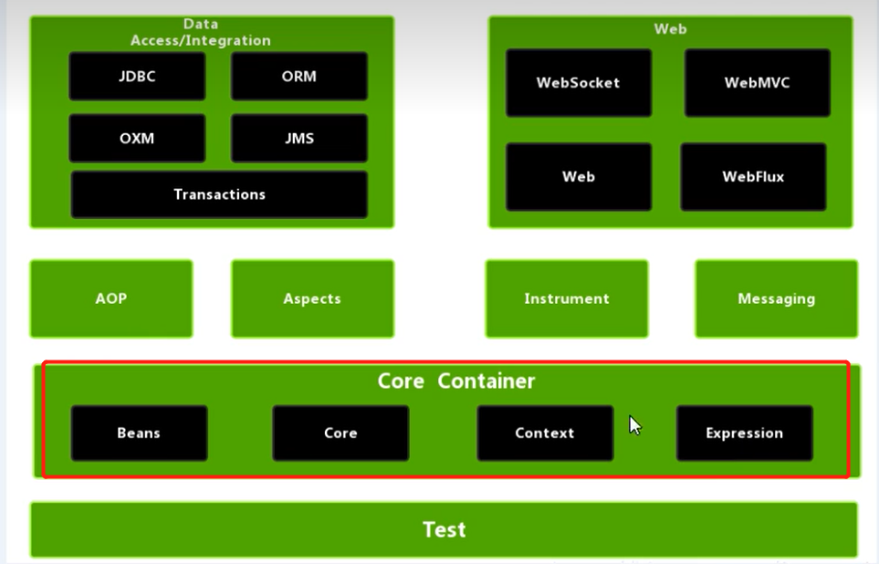
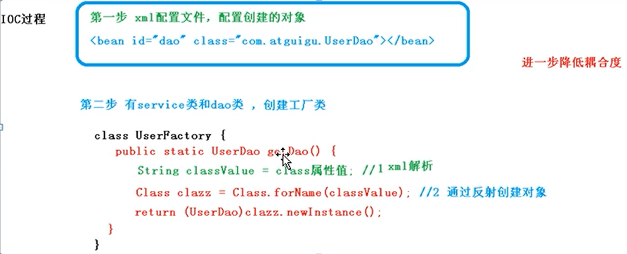

## Spring 重学

### 1. Spring概念

> 1. spring 轻量级的开源的JavaEE框架。
>2. 可以解决企业应用开发的复杂性
>3. 两个核心部分 ：IOC和Aop
>> 1. IOC：控制反转，把创建对象的过程交给Spring容器进行管理
>>2. Aop：面向切面，不修改源代码，进行功能增强

4. 特点：

> 1. 方便解耦，简化开发
>2. Aop编程支持
>3. 方便程序测试
>4. 方便和其他框架进行整合
>5. 方便进行事物操作
>6. 降低APi开发难度

5. Spring5 学习

# Spring Core Container

> ## Beans === Core === Context === Expression

# 如何使用Spring管理对象

> 1. 加载4个（beans、core、context、expression）核心jar包和一个commons-logging公共jar包
> 2. 创建java类----》》 创建Spring的配置文件（xml格式），在配置文件配置需要创建的对象（<bean id="" class=""/>）。
> 3. 加载配置文件----》》获取配置创建的对象----》》得到需要的对象

### 2. IOC容器

#### 1. IOC底层原理

> 什么是IOC？
> 控制反转，把对象的创建和对象之间的调用过程，交给Spring管理
> 使用IOC目的，降低耦合度
> 底层原理：xml解析，工程模式，反射
>> IOC过程 
>> 

#### 2. IOC接口（BeanFactory）
> 1. IOC思想基于IOC容器完成，IOC容器底层就是对象工厂
> 2. Spring提供IOC容器实现两种方式：（两个接口）。作用即：加载配置文件，通过工厂去创建对象
>> 2.1. BeanFactory：IOC容器基本实现，是Spring内部实现，一般不面向开发人员使用
>> 在加载配置文件的时候不会创建对象，在使用的时候才去创建对象
>> 2.2. ApplicationContext：BeanFactory接口的子接口，提供更多更强大的功能，工开发人员使用
>> 在加载配置文件的时候就进行创建对象
> 3. ApplicationContext主要实现类（2个）
>> FileSystemXmlApplicationContext  路径需要完整的带盘符的路径（c:...）
>> ClassPathXmlApplicationContext  项目路径（com....）
### 什么是Bean管理：指两个操作
> 1. Spring创建对象
> 2. Spring注入属性：给属性赋值
#### 3. IOC操作Bean管理（基于xml）
> 1. xml方式创建对象
>> `<bean id="User" class="com.xxx.xxx.User"></bean>`
>> 创建对象的时候，默认执行无参构造，完成对象创建
> 
> 2. xml方式注入属性
>> DI：依赖注入，就是注入属性
>> 1. 使用set方法注入
>>> bean标签中使用property标签
>> 2. 使用有参构造进行注入
>>> bean标签中使用constructor-arg标签

>>> DI是IOC中一种具体实现，它就表示注入属性，要在创建对象的基础之上完成
#### 4. IOC操作Bean管理（基于注解（@...））

### 3. AOP

### 4. JdbcTemplate

### 5. 事物管理

### 6. Spring5新特性

* jgklajl

